# OCI Network VCN and Subnets

## Introduction

Estimated Time: 15 minutes

### About Virtual Cloud Networks and Subnets

Virtual Cloud Networks (VCNs) provide customizable and private cloud networks in Oracle Cloud Infrastructure (OCI). Just like a traditional data center network, the VCN provides customers with complete control over their cloud networking environment. This includes assigning private IP address spaces, creating subnets and route tables. [Visit our documentation](https://docs.oracle.com/en-us/iaas/Content/Network/Tasks/Overview_of_VCNs_and_Subnets.htm) for more information on Virtual Cloud Networks.

A Subnet is a subdivision of a VCN. Each subnet in a VCN consists of a contiguous range of IPv4 addresses and optionally IPv6 addresses that do not overlap with other subnets in the VCN.

A security list acts as a virtual firewall for an instance, with ingress and egress rules that specify the types of traffic allowed in and out. The default security list will be updated to allow the VTAP traffic to flow within the VCN. [Visit our documentation](https://docs.oracle.com/en-us/iaas/Content/Network/Concepts/securitylists.htm) for more information on Security Lists.

### Objectives

In this lab, you will:

* Create a Log Group to organize the subnet Flow Logs
* Build a Virtual Cloud Network (VCN) to provide the foundation for the network access
* Create three public subnets in the VCN to accommodate the client/server communication and the VTAP monitoring
* Enable Flow Logging for each subnet

When you complete the exercise, the network topology will look like the following, one VCN and three subnets.

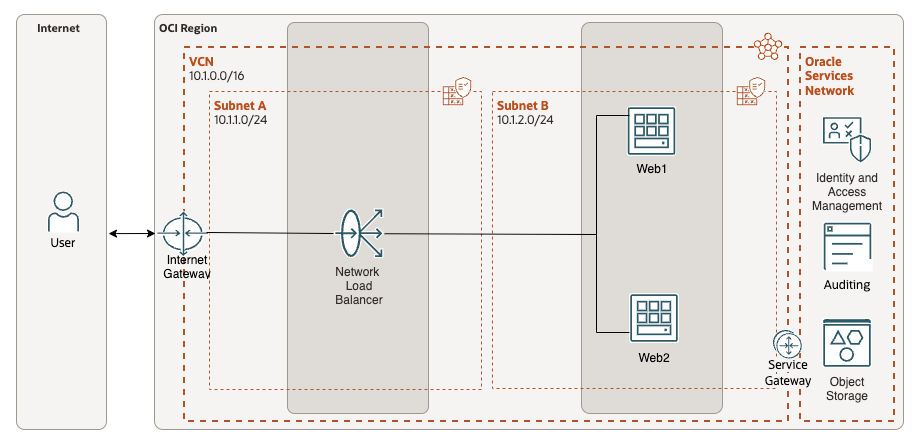

### Prerequisites

* Basic knowledge of OCI Networking components and networking.

## Task 1: Select a Home Region

Let's begin.

1. To begin the lab exercise, ensure you are logged into the Oracle Cloud console and select the desired **Home Region** region. The region can be accessed on the menu bar located at top right of the screen.

    * Click **"US East (Ashburn)"**

        

        **Note**: This lab can be completed in any OCI region you have access to with the required resources. Based on your account, select the desired region to complete the exercise. For the purpose of this lab we will use the **"US East (Ashburn)"** region.

## Task 2: Create a VCN (Virtual Cloud Network)

We will start with a basic VCN deployment. One of the goals of this **livelab** is also to provide an understanding of OCI constructs needed for deploying the compute instances and creating a load balanced application using the NLB. For this reason, we will not use the VCN Wizard which deploys all OCI Gateways and creates basic routing rules. Instead, we will manually create each artifact as needed.

Let's begin.

1. On the Oracle Cloud Infrastructure Console Home page, using the Navigation menu (on top left) click **Networking** and click on **Virtual cloud networks**.

    * Click the Navigation Menu (top left corner)
    * Click **"Networking"**
    * Click **"Virtual cloud networks"**

        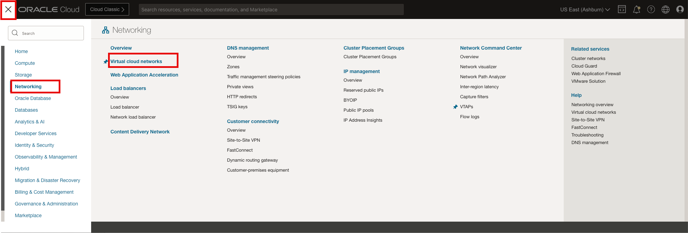

2. Make sure you have the correct Compartment selected and click **Create VCN** in the **Virtual Cloud Networks** table. The VCN will provide the network foundation for all the components related to the compute instances and required network monitoring.

    * Click **"Create VCN"**
    * Name: **"nlb-vcn"**
    * IPv4 CIDR: **"10.1.0.0/16"** (Press enter)
    * Click **"Create VCN"**

        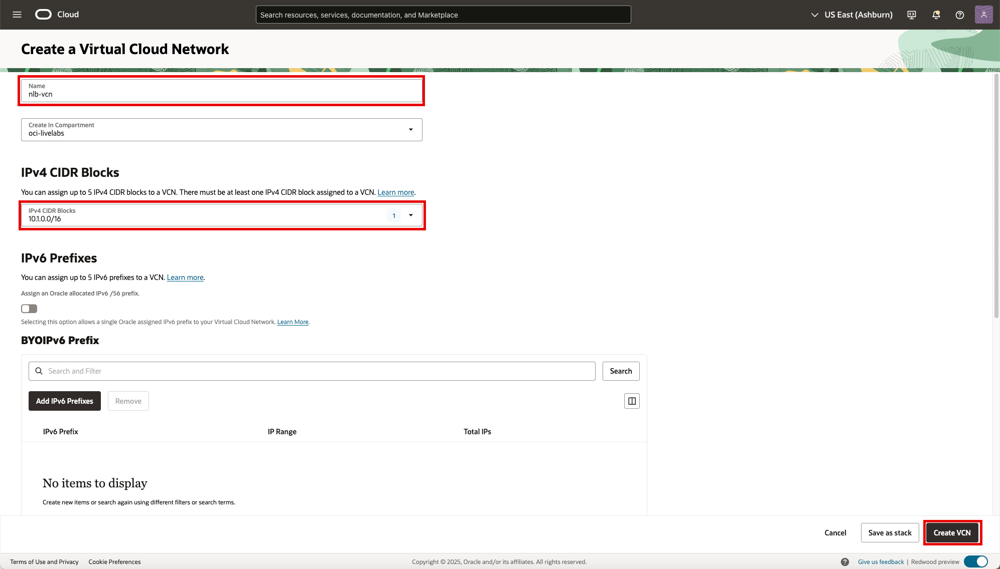

        **Note**: If not directed to update/change a field, leave everything else as default.

3. The **VCN** is created, you can now move forward to the **Next Task**.

    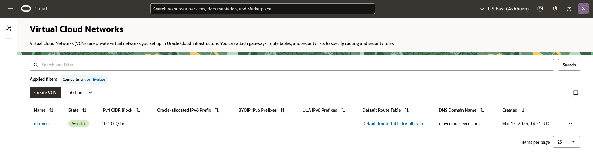

    **Note**: Upon creating the **VCN** the workflow will take you directly to the subnet creation page.

## Task 3: Create VCN Subnets

Now that we have a VCN created, we will create three subnets for the compute and network resources.

Let's begin.

1. Select the created **VCN** in the table. Once selected, the VCN **Details** will be displayed in the landing page.

    * Name: **"nlb-vcn"**

        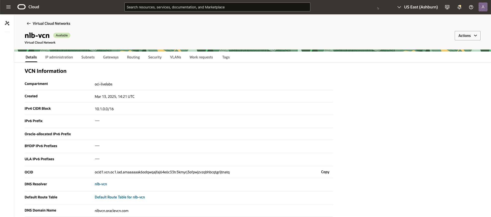

2. In the VCN table, Click **Subnets** then **Create Subnet** to create the first subnet. The first subnet will provide network access for the public facing load balancer.

    * Click **"Subnets"**

        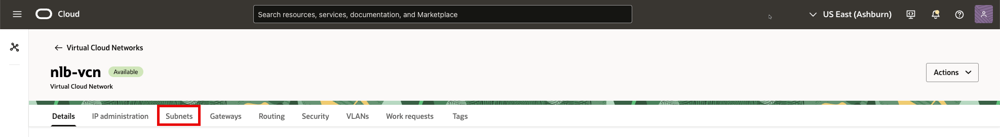

    * Click **"Create Subnet"**
    * Name: **"nlb-vcn-snet1"**
    * IP Type: **"IPv4 CIDR Block"**
    * IPv4 CIDR: **"10.1.1.0/24"**
    * Click **"Create Subnet"**

        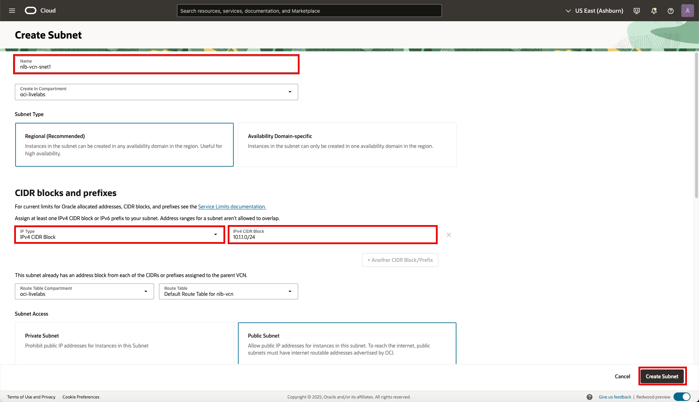

        **Note**: We will repeat this step for the additional subnet.

3. In the Subnets table, Click **Create Subnet** to create the second subnet. The second subnet will provide network access for the compute instances representing the web servers.

    * Click **"Create Subnet"**
    * Name: **"nlb-vcn-snet2"**
    * IP Type: **"IPv4 CIDR Block"**
    * IPv4 CIDR: **"10.1.2.0/24"**
    * Click **"Create Subnet"**

        

4. The **subnets** are created, you can now move forward to the **Next Task**.

    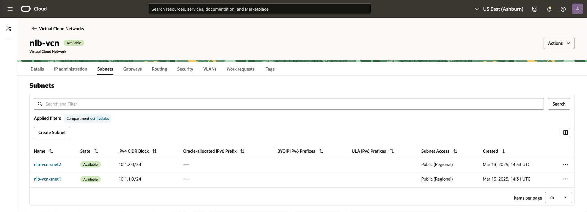

## Task 4: Create Internet Gateway

1. In the VCN table, Click **Gateways** then **Create Internet Gateway** to create the internet gateway.

    * Click **"Gateways"**
    * Click **"Create Internet Gateway"**

        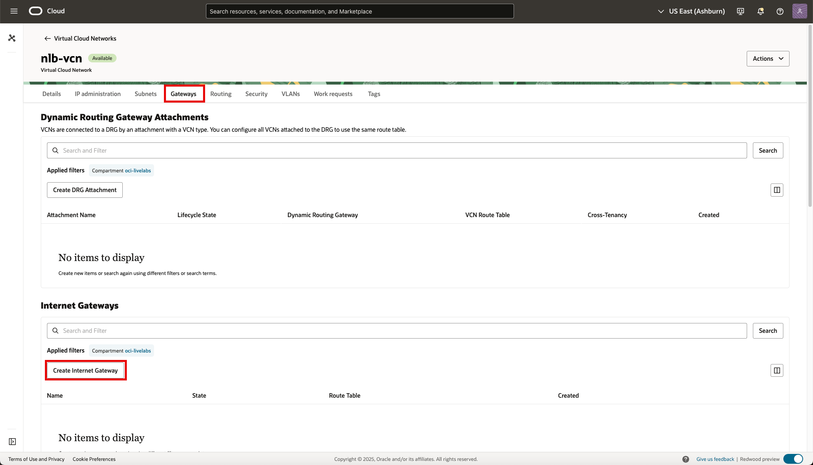

2. Create the Internet Gateway.

    * Name: **"nlb-vcn-igw"**
    * Click **"Create Internet Gateway"**

        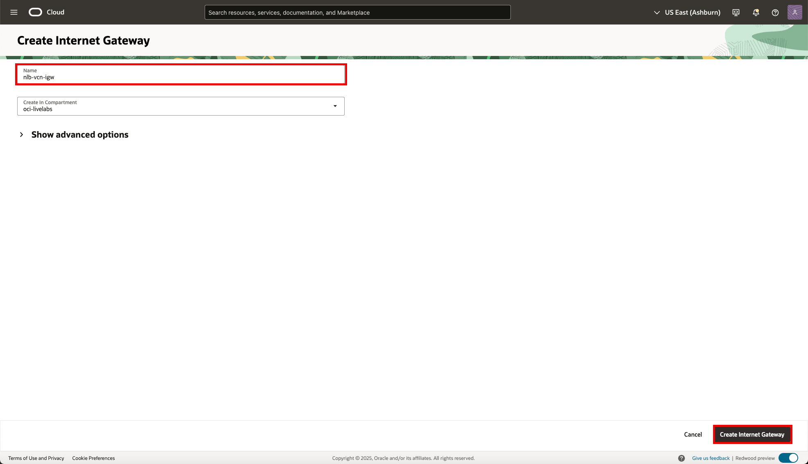

3. Internet Gateways.

    * Internet Gateways

        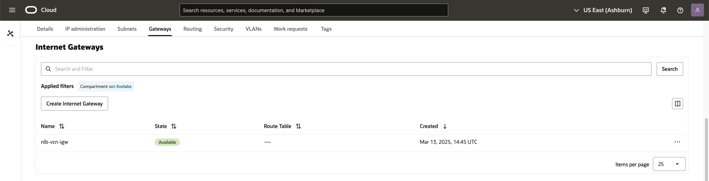

## Task 4: Update Routing Table

1. In the VCN table, Click **Routing** then **Default Route Table for nlb-vcn** to create the internet gateway route.

    * Click **"Routing"**
    * Click **"Default Route Table for nlb-vcn"**

        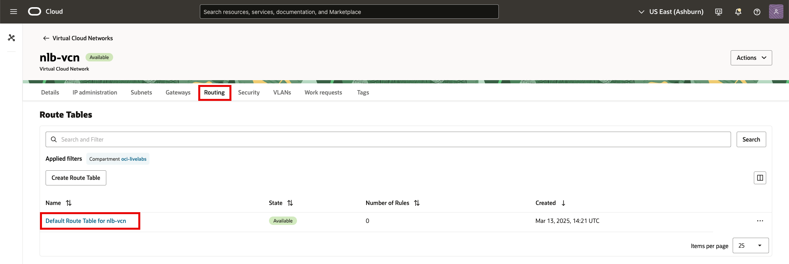

2. Select the Route Rule.

    * Click **"Route Rules"**
    * Click **"Add Route Rules"**

        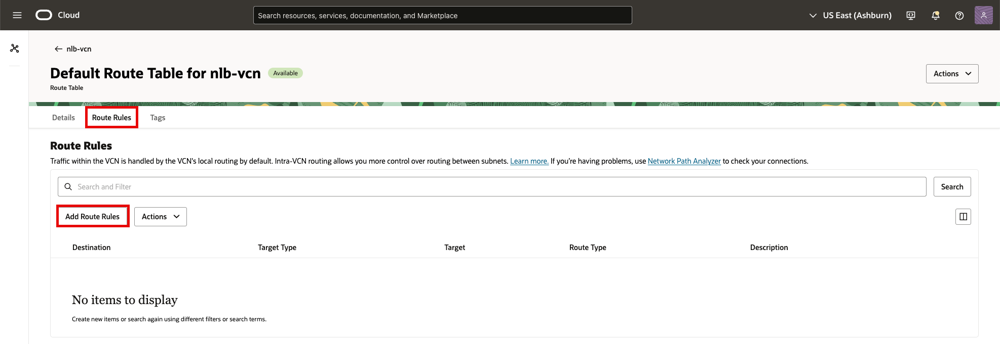

3. Add the Route Rule.

    * Target Type: **"Internet Gateway"**
    * Destination CIDR Block **"0.0.0.0/0"**
    * Target Internet Gateway: **"nlb-vcn-igw"**
    * Click **"Add Route Rules"**

        

4. Default Internet Gateway route.

    * Route Rules

        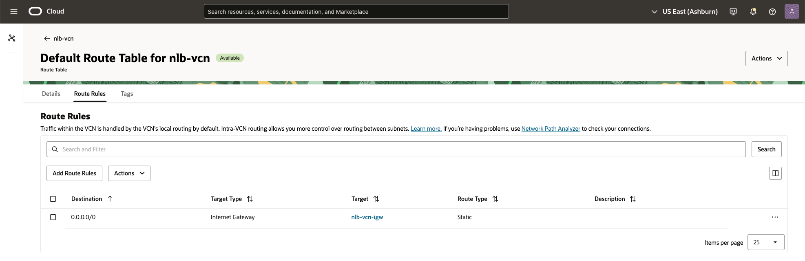

## Task 4: Update Security List

Unlike other security lists, the default security list comes with an initial set of stateful rules, which should in most cases be changed to only allow inbound traffic from authorized subnets relevant to the region that homes that VCN or subnet. For this exercise we will modify the default security list to include the web server port, TCP 80.

Let's begin.

1. In the VCN table, Click **Security** then **Default Security List for nlb-vcn** to create the internet gateway route.

    * Click **"Security"**
    * Click **"Default Security List for nlb-vcn"**

        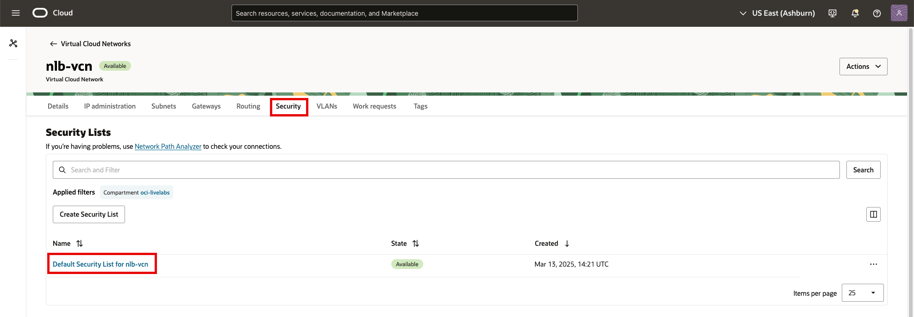

2. Select the **Security rules** and **Add Ingress Rultes**.

    * Click **"Security rules"**
    * Click **"Ingress Rules"**

        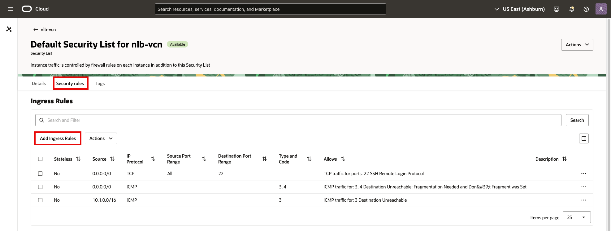

3. Add the Security List Rule.

    * Source CIDR: **"0.0.0.0/0"**
    * Select IP Protocol: **"TCP"**
    * Destination Port Range: **"80"**
    * Click **"Add Ingress Rules"**

        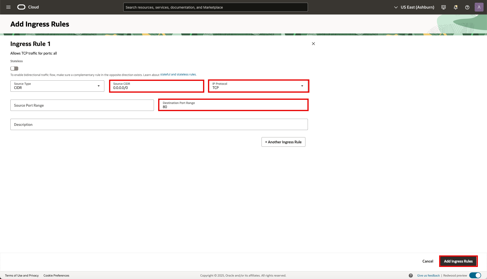

4. Default Internet Gateway route.

    * Security List Rules

        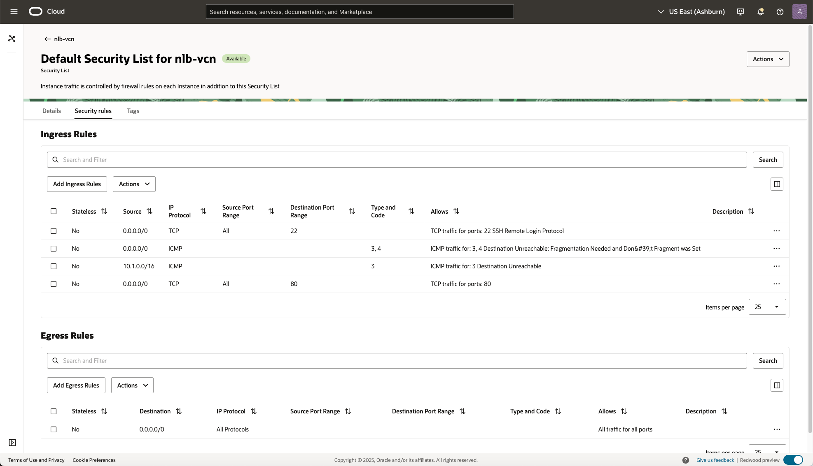

5. Click **Oracle Cloud** in the top left of the menu bar to return to the home page.

    * Click **"Oracle CLoud"**

        

**Congratulations!** You have successfully created a VCN and the associated Subnets. You may now **proceed to the next lab**.

## Acknowledgements

* **Author** - Gabriel Fontenot, Principal Cloud Architect, OCI Networking
* **Last Updated By/Date** - Gabriel Fontenot, March 2025