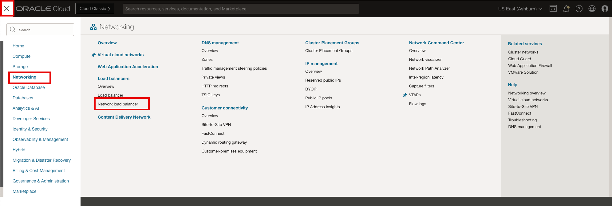
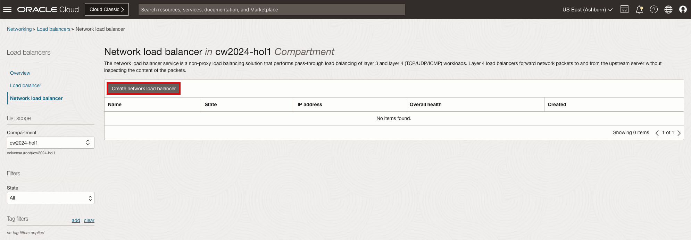
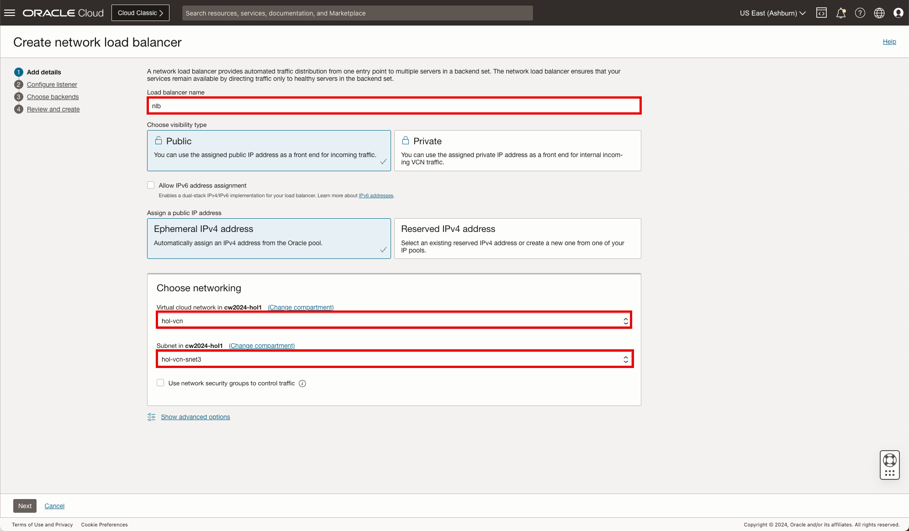
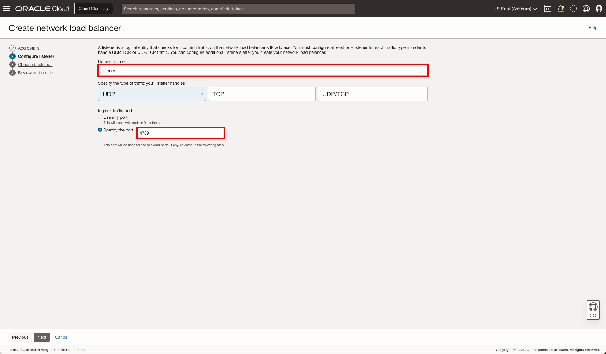
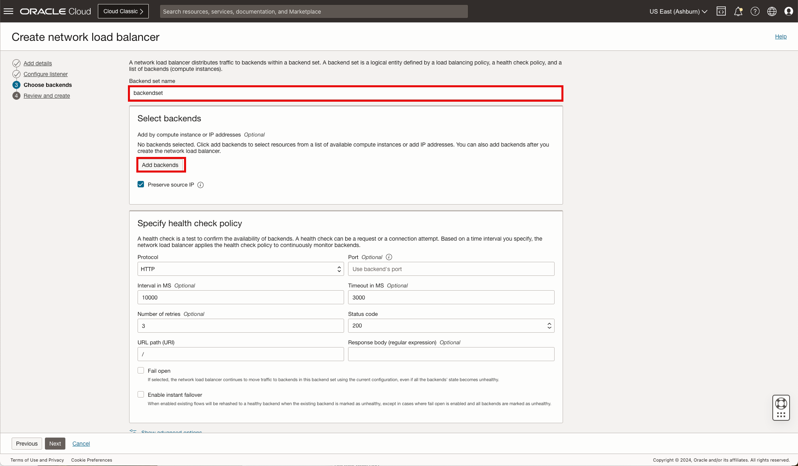
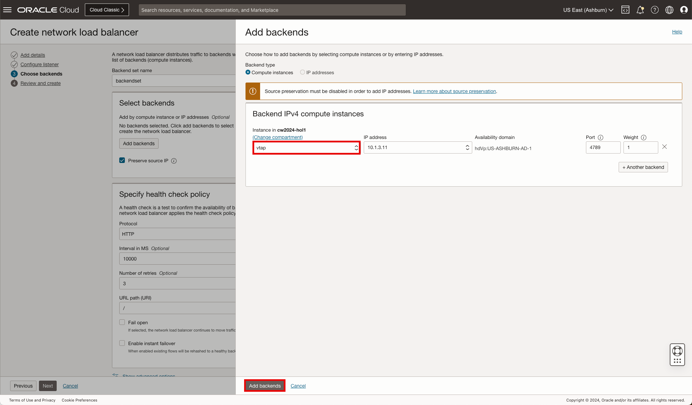
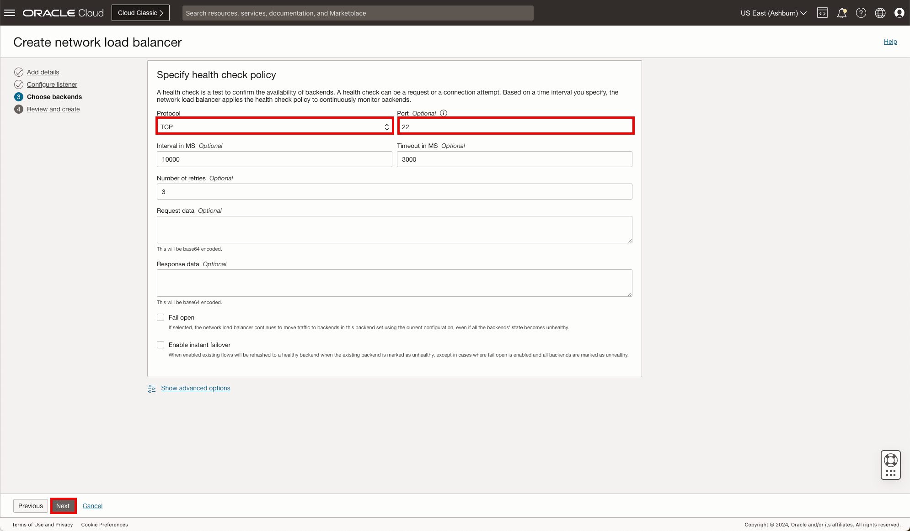
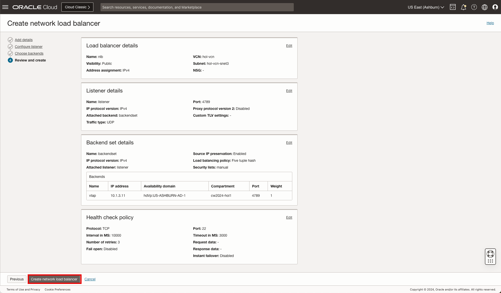

# OCI Network VTAPs and Flow Logs

## Introduction

Estimated Time: 20 minutes

### About Network Load Balancers

Network Load Balancer provides the benefits of flow high availability, source and destination IP addresses, and port preservation. It is designed to handle volatile traffic patterns and millions of flows, offering high throughput while maintaining ultra low latency. The Network Load Balancer will be used to distribute traffic to the compute instances created in the previous lab exercise. [Visit our documentation](https://docs.oracle.com/en-us/iaas/compute-cloud-at-customer/topics/nlb/network-load-balancing.htm) for more information on NLBs.

### Objectives

In this lab, you will:

* Deploy an instance of an NLB (Network Load Balancer) as a receiver for VTAP flows
* Generate network traffic from the client to the server

  

### Prerequisites

* Basic knowledge of OCI Networking components and networking.

## Task 1: Create NLB

We are now ready to deploy the **Network Load Balancer**, NLB, that will be used by the VTAP in the subsequent steps.

Let's begin.

1. On the Oracle Cloud Infrastructure Console Home page, using the Navigation menu (on top left) click **Networking** and under Load Balancers select **Network load balancer**, then **Create network load balancer**.

    * Click the Navigation Menu (top left corner)
    * Click **"Networking"**
    * Click **"Network load balancer"**

      

    * Click **"Create network load balancer"**

      

2. In the Network load balancer **Add details** screen, update the **Load balancer name** and scroll down to **Choose networking** section to update the subnet then click **Next**.

    * Load balancer name: **"nlb"**
    * Virtual cloud network: **"nlb-vcn"**
    * Subnet: **"nlb-vcn-snet3"**
    * Click **"Next"**

      

## Task 2: Create NLB Listeners

1. In the Network load balancer **Configure listener** screen, update the name and select **Specify the port** and provide the UDP port number then click **Next**.

    * Listener name: **"listener"**
    * Specify the port: **"80"**
    * Click **"Next"**

      

## Task 3: Create NLB Backendsets

1. In the Network load balancer **Choose backends** screen, update the name and select **Add backends** and update the **Specify the health check** then click ** **Next**.

    Select backends

    * Name: **"backendset"**
    * Click **"Add backends"**

      

    Add Backends

    * Select Instance: **"web1"**
    * Click **"Add backends"**

    * Select Instance: **"web2"**
    * Click **"Add backends"**

      

    Specify Health check policy
    * Protocol: **"Protocol"**
    * Port: **"TCP Port 80"**
    * Click **"Next"**

      

2. In the Network load balancer **Review and create** screen, review the configuration and click ** **Create network load balancer**.

    * Click **"Create network load balancer"**

      

3. The **NLB** is configured, you can now move forward to the **Next Task**

## Task 2: Build the Web servers

1. SSH to compute instance, web-server1

    * Commandline: **"CMD1"**
    * Commandline: **"CMD2"**
    * Commandline: **"CMD3"**

2. SSH to compute instance, web-server1

    * Commandline: **"CMD1"**
    * Commandline: **"CMD2"**
    * Commandline: **"CMD3"**

## Task 3: Test access to your Load Balanced application

1. Navigate to the Public IP address of the NLB using your browser.

**Congratulations!** You have completed this lab.

## Acknowledgements

* **Author** - Gabriel Fontenot, Principal Cloud Architect, OCI Networking
* **Last Updated By/Date** - Gabriel Fontenot, March 2025
