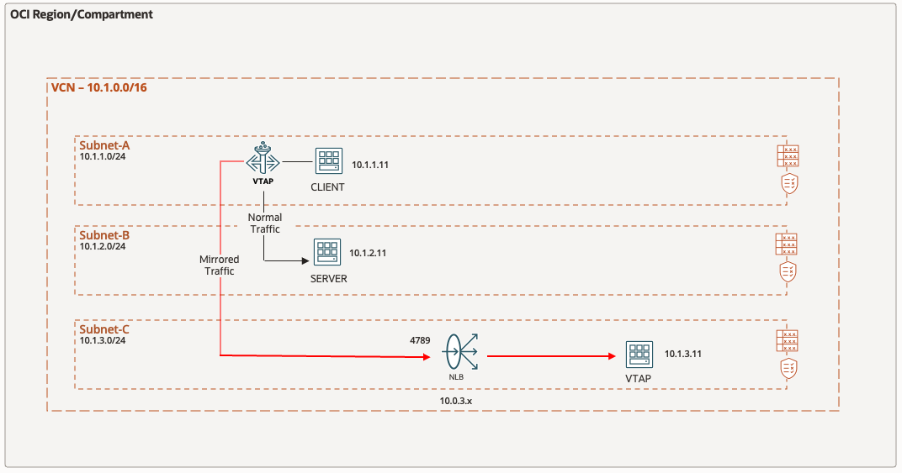

# OCI Network VTAPs and Flow Logs

## Introduction

Estimated Time: 20 minutes

### About Network Load Balancers

Virtual Test Access Point, VTAP, functionality is sometimes referred to as traffic mirroring. It copies traffic that traverses a specific point in the network and sends the mirrored traffic to a network packet collector or network analytics tool for further analysis. A VTAP is like a virtual version of port mirroring except, instead of mirroring a port, we mirror traffic at a specific Oracle resource, such as OCI Database service, Exadata virtual machine (VM) cluster, instance virtual network interface cards (VNICs), load balancer as a service (LBaaS), or Autonomous Data Warehouse. Mirrored traffic generated at the VTAP source counts against the total available bandwidth of the VNIC. If congestion occurs, OCI prioritizes production traffic, and mirrored traffic is dropped first. [Visit our documentation](https://docs.oracle.com/en-us/iaas/Content/Network/Tasks/vtap.htm) for more information on VTAPs.

Network Load Balancer provides the benefits of flow high availability, source and destination IP addresses, and port preservation. It is designed to handle volatile traffic patterns and millions of flows, offering high throughput while maintaining ultra low latency. The Network Load Balancer will be used by the VTAP for receiving VTAP flows and distributing output for monitoring. [Visit our documentation](https://docs.oracle.com/en-us/iaas/compute-cloud-at-customer/topics/nlb/network-load-balancing.htm) for more information on NLBs.

A security list acts as a virtual firewall for an instance, with ingress and egress rules that specify the types of traffic allowed in and out. The default security list will be updated to allow the VTAP traffic to flow within the VCN. [Visit our documentation](https://docs.oracle.com/en-us/iaas/Content/Network/Concepts/securitylists.htm) for more information on Security Lists.

### Objectives

In this lab, you will:

* Deploy an instance of an NLB (Network Load Balancer) as a receiver for VTAP flows
* Create a VTAP for monitoring network communications between the client and server compute instances
* Update the default Security List to include the VTAP port
* Generate network traffic from the client to the server
* Use the VTAP monitor and Flow Logs to identify the client/server network flows

  

### Prerequisites

* Basic knowledge of OCI Networking components and networking.

## Task 1: Create NLB

We are now ready to deploy the **Network Load Balancer**, NLB, that will be used by the VTAP in the subsequent steps.

Let's begin.

1. On the Oracle Cloud Infrastructure Console Home page, using the Navigation menu (on top left) click **Networking** and under Load Balancers select **Network load balancer**, then **Create network load balancer**.

    * Click the Navigation Menu (top left corner)
    * Click **"Networking"**
    * Click **"Network load balancer"**

      

    * Click **"Create network load balancer"**

      

2. In the Network load balancer **Add details** screen, update the **Load balancer name** and scroll down to **Choose networking** section to update the subnet then click **Next**.

    * Load balancer name: **"nlb"**
    * Virtual cloud network: **"nlb-vcn"**
    * Subnet: **"nlb-vcn-snet3"**
    * Click **"Next"**

      

3. In the Network load balancer **Configure listener** screen, update the name and select **Specify the port** and provide the UDP port number then click **Next**.

    * Listener name: **"listener"**
    * Specify the port: **"80"**
    * Click **"Next"**

      

4. In the Network load balancer **Choose backends** screen, update the name and select **Add backends** and update the **Specify the health check** then click ** **Next**.

    Select backends

    * Name: **"backendset"**
    * Click **"Add backends"**

      

    Add Backends

    * Select Instance: **"web1"**
    * Click **"Add backends"**

    * Select Instance: **"web2"**
    * Click **"Add backends"**

      

    Specify Health check policy
    * Protocol: **"Protocol"**
    * Port: **"TCP Port 80"**
    * Click **"Next"**

      

5. In the Network load balancer **Review and create** screen, review the configuration and click ** **Create network load balancer**.

    * Click **"Create network load balancer"**

      

6. The **NLB** is configured, you can now move forward to the **Next Task**

## Task 2: Test access to your Load Balanced application

1. Navigate to the Public IP address of the NLB using your browser.

**Congratulations!** You have completed this lab.

## Acknowledgements

* **Author** - Gabriel Fontenot, Principal Cloud Architect, OCI Networking
* **Last Updated By/Date** - Gabriel Fontenot, March 2025
